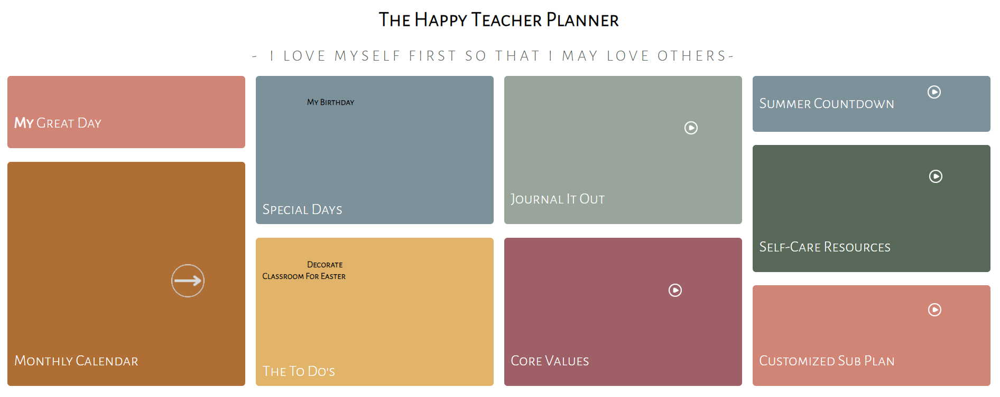
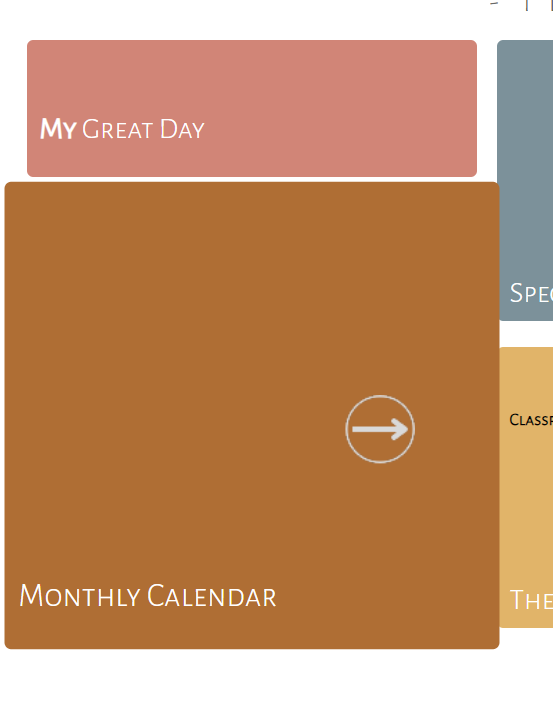

#  The Happy Teacher Planner 
**Mobile Friendly** 
This website is a teacher planner with a focus on gratitude. 
Some days can be more challenging than others, but with a consistent focus on gratitude and organization, that challenge is easier to overcome.  
Use <strong>My Great Day</strong> to customize the name of your planner.  
Use the <strong>Monthly Calendar</strong> to add <strong>To Do</strong> events, <strong>Special Day</strong> events and Notes to help you stay organized.  
Use <strong>Journal</strong> to journal out your thoughts before or after you start your day; this helps you have mental clarity.  
Use <strong>Core Values</strong> to choose your top 6 core values; use these as a reminder about what is most important to you. 
Use <strong>Self-Care Resources</strong> when you need a break during class or after; videos, community, blogs, meditations and book suggestions. 
Use <strong>Customized Sub-Plan</strong> to create your Substitute Plan and always have it handy. Screenshot it if you are mobile or save as a PDF and print/email to the subsitute teacher or administration. 

## Link to Website
This site is available through github pages: [The Happy Teacher Planner](https://colletteap.github.io/gratitude-planner/)

# How to Use

<strong>Monthly Calendar</strong>  

