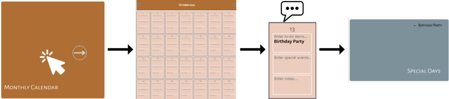

# 

Some days can be more challenging than others. By focusing on gratitude and organization, that challenge is easier to overcome.  

# **Website Link**
- This site is available through github pages: [The Happy Teacher Planner](https://colletteap.github.io/gratitude-planner/)

# **Website Instructions**

<ul>
  ><li>Use <strong>My Great Day</strong> to customize the name of your planner.</li>
</ul>

<ul>
  ><li>Use the <strong>Monthly Calendar</strong> to add <strong>To Do</strong> events, <strong>Special Day</strong> events and Notes to help you stay organized.</li>
</ul>

<ul>
  ><li>Use <strong>Journal</strong> to journal out your thoughts before or after you start your day; this helps you have mental clarity.</li>
</ul>

<ul>
  ><li>Use <strong>Core Values</strong> to choose your top 6 core values; use these as a reminder about what is most important to you.</li>
</ul>

<ul>
  ><li>Use <strong>Self-Care Resources</strong> when you need a break during class or after; videos, community, blogs, meditations and book suggestions.</li>
</ul>

<ul>
  ><li>Use <strong>Customized Sub-Plan</strong> to create your Substitute Plan and always have it handy. Screenshot if you are mobile or save as a PDF and print/email to the subsitute teacher or administration.</li>
</ul>

  

  # **Appreciation**
  
  Big thanks to @samwise-nl for coaching me through the Get Coding program so far!
